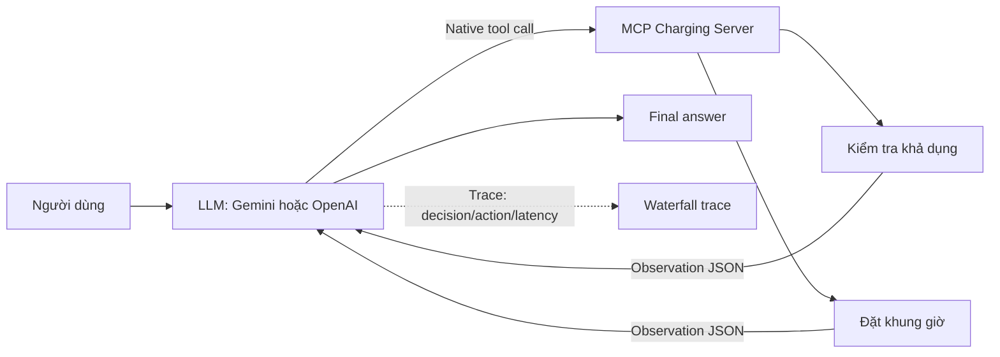

# Trợ lý Trạm Sạc VinFast — ReAct Agent

Bài Lab 3: tra cứu cổng sạc và tạo booking bằng Gemini/OpenAI/OpenRouter Native Tool Calling. Trạm, tải và booking là dữ liệu mô phỏng; không kết nối dịch vụ VinFast thật.

## Chạy nhanh

Dùng Python 3.10–3.12 cho môi trường mới. Môi trường Python 3.9 hiện có đã chạy các test, nhưng SDK phát cảnh báo hỗ trợ.

```bash
python3 -m venv .venv
.venv/bin/python -m pip install -r requirements.txt
LLM_PROVIDER=mock .venv/bin/python src/app.py --all
.venv/bin/python -m unittest discover -s tests -v
```

Cấu hình `.env` theo `.env.example` nếu chưa có. Nếu đã có key, chỉnh file hiện tại; không chép đè. Không commit `.env`.

OpenRouter dùng OpenAI-compatible endpoint: đặt `LLM_PROVIDER=openrouter`, `OPENROUTER_API_KEY` và (tùy chọn) `OPENROUTER_MODEL`. Chỉ chọn model có hỗ trợ tool calling khi cần nghiệm thu native tool calling.

```bash
.venv/bin/python src/app.py --interactive
.venv/bin/python src/app.py --all --no-retry
.venv/bin/python src/app.py --baseline "Tìm trạm CCS2 và đặt sạc cho tôi."
.venv/bin/python src/demo_dynamic.py --scenario race
```

## Cấu trúc

- `src/app.py`: CLI, vòng lặp ReAct, lịch sử native, trace và chấm 5 test.
- `src/providers.py`: chọn LLM/Mock và retry có đo thời gian.
- `src/native_transport.py`: Gemini function response / OpenAI tool message.
- `src/tools.py`, `src/mcp_server.py`: dữ liệu, hai tool và MCP mô phỏng.
- `src/prompts.py`: quy tắc và prompt baseline.
- `src/demo_dynamic.py`: tình huống chọn trạm khác và hết cổng giữa lúc đặt.
- `config/`: bộ 5 test chính và bản mẫu cùng chủ đề.
- `tests/`: kiểm thử hồi quy và hợp đồng native bằng SDK/test doubles.
- `docs/`: báo cáo, hướng dẫn, bằng chứng API và tài liệu lớp học.
- `artifacts/`: kết quả chạy thử; được Git bỏ qua, các log cũ giữ tại `artifacts/previous/`.
- `src/ai_levels/`: tài liệu mã tham khảo gốc của lớp, không dùng khi chạy Agent.

## Luồng ReAct và tool calling



| Tool | Dùng để | Kết quả quan trọng |
| --- | --- | --- |
| `check_charging_availability` | Lọc trạm theo vị trí, đầu sạc và khung giờ tùy chọn | Trạm phù hợp, cổng còn trống, tải, khả dụng theo slot |
| `reserve_charging_slot` | Tạo booking sau khi trạm vẫn còn cổng | Mã booking hoặc `UNAVAILABLE`/`NOT_FOUND` |

Khi booking nhận `UNAVAILABLE`, agent không tự xác nhận thành công: scenario `race` chứng minh agent tra cứu lại và chọn phương án khác.

## Kết quả và giới hạn

Bản trước có bằng chứng 5/5 Gemini thật trong [trace_waterfall.json](docs/trace_waterfall.json). Bản native mới đạt 20 kiểm thử offline/contract; Gemini wire-format đã được kiểm tra để bỏ riêng trường JSON Schema không được Gemini hỗ trợ. Lượt thử API mới bị 429, nên chưa dùng kết quả cũ để chứng nhận bản mới. Chạy `--all` khi có quota để sinh `docs/trace_native_api.json` và `docs/test_results_native_api.json`.

Lịch sử Gemini giữ nguyên model content/thought signature; kết quả tool gửi qua `function_response`. OpenAI dùng assistant tool calls và `role=tool` với đúng call ID. Trace chỉ ghi lý do ngắn công khai nếu model cung cấp, không ghi suy nghĩ nội bộ.

MCP vẫn là lớp mô phỏng cùng tiến trình. Tải tĩnh và booking nằm trong bộ nhớ; sức chứa đã được kiểm tra theo các khoảng thời gian chồng lấn, nhưng chưa có dự báo tải hoặc lưu bền vững. Mock là kịch bản kiểm thử, không thay thế nghiệm thu LLM thật.

Hướng dẫn chi tiết: [TESTING.md](docs/TESTING.md). Báo cáo: [trace_eval.md](docs/trace_eval.md). Tài liệu gốc: [CODELAB.md](docs/CODELAB.md).

## Checklist trước khi nộp

```bash
.venv/bin/python -m unittest discover -s tests -v
LLM_PROVIDER=mock .venv/bin/python src/app.py --all
git status
```

Không đánh dấu API live PASS nếu `docs/test_results_native_api.json` chưa có 5 kết quả PASS. Điền họ tên/MSSV trong `docs/trace_eval.md`, commit, push lên GitHub và dán link repo vào LMS.
